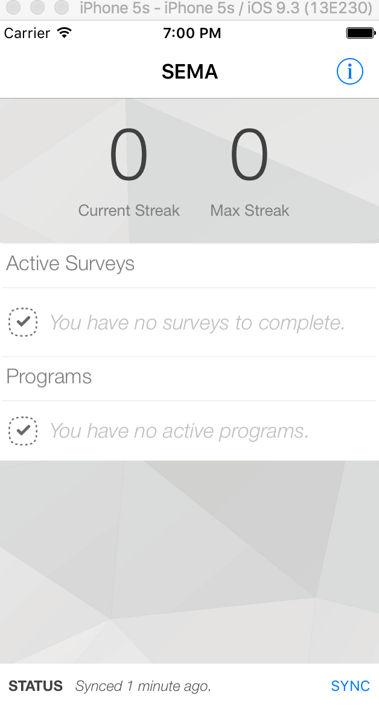

# SEMA2 iOS App

<p align="center">
  
</p>


## Project Summary:

SEMA (Smartphone Ecological Momentary Assessment) is a suite of software for designing and conducting smartphone-based survey research. SEMA v2 involves administering a survey several times per day (at random times) over several days. However, SEMA2 can also be used to administer surveys less frequently (e.g., once daily, as in daily diary studies), or on an ad hoc basis (i.e., participants launch the survey manually at any time). Following extensive testing of the initial version of SEMA in 2013-2014, SEMA2 was developed in 2015 by researchers at Australian Catholic University and Orygen-The National Centre of Excellence in Youth Mental Health, in collaboration with a private software developer, Boosted Human. SEMA2 includes a multitude of features that enable researchers to easily and intuitively create and administer smartphone surveys and easily access and analyse collected data.


## Authors:

Ashemah Harrison

Starehe Harrison


## Project hosting page:

https://github.com/eorygen/sema2_ios

Alternatively, users who do not have git installed on their machine may download it by clicking on Clone or download button, click on Download ZIP. Note an uncompress tool is required to extract the project files from the ZIP file.


## Issue Tracker:

https://github.com/eorygen/sema2_ios/issues


## Forum & Mailing List:

https://groups.google.com/forum/#!forum/sema-surveys


## Documentation:

https://github.com/eorygen/sema2_ios/wiki


## Requirements:

 - Mac OS
 - XCode


## Installation:

In Terminal, type the following:

$ cd Path_to/sema2_ios/app

$ sudo gem install -n /usr/local/bin/cocoapods

Install third party library dependencies:

$ pod install

If you get errors, try changing Podfile file target 'sema2' to target 'sema2 - acu'. Run pod install again.

Open file sema2.xcworkspace
Click Product > Edit Scheme
Click Build > Add Pods library and moved them to top of list
Click Clean and Build again

NOTE: Podfile target must be the same as xcode build target eg. “sema2 – acu”
If not clean and close project, run $pod install, open .xcworkspace > build again

Go to sema2 - acu > Build Settings > Packaging > Info.plist File > Debug > change to sema2/Info-dev.plist

Add to Info-dev.plist: (to avoid Secure protocol error)

```html
<key>NSAppTransportSecurity</key>
<dict>
	<key>NSAllowsArbitraryLoads</key>
	<true/>
</dict>
```

Click the Play button to build and deploy the app to the simulator.


